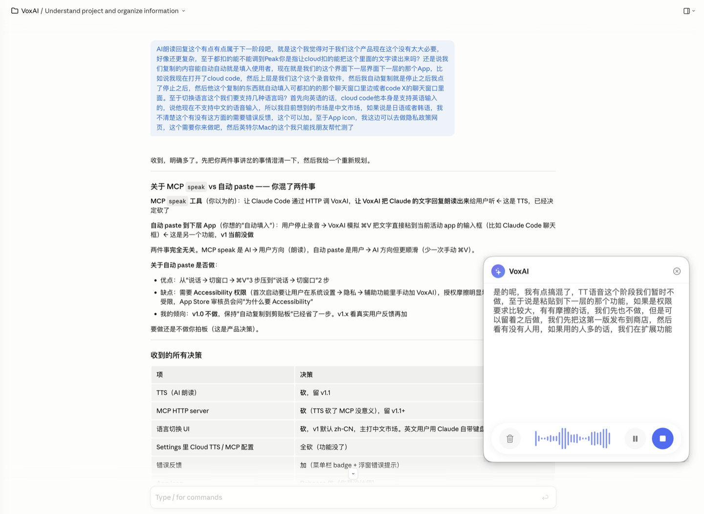

# VoxAI — 用嘴编程

[](https://apps.apple.com/cn/app/voxai-用嘴编程/id6766570591)
[](https://www.apple.com/macos/)
[](LICENSE)

> 给 Claude Code / Cursor 等 AI 编程工具加一层中文语音输入。
> 说一句话 → 文字自动进剪贴板 → 切到 AI 工具 ⌘V 粘贴。

[English version below ↓](#english)



---

## 它是什么

VoxAI 是一款 macOS 应用，主要解决一个具体痛点：**Claude Code / Cursor 等 AI 编程工具不支持中文语音输入**。VoxAI 在所有应用之上常驻一个浮窗，让你用中文说话，文字实时显示，停下后自动复制到剪贴板。整个"想 → 说 → 出现在 AI 输入框"流程不用碰键盘。

**核心卖点**：
- 🎙️ 系统级中文语音识别（Apple SFSpeechRecognizer，自动标点）
- 📋 录音停止后**自动复制到剪贴板**——主推体验
- 🪟 浮窗常驻最上层，跨 App / 跨 Space / 全屏可见
- 🇨🇳 中文优先，英文系统也有完整翻译

**v1.0 不做**（留 v1.x 视用户反馈）：
- AI 朗读回复（TTS）
- MCP HTTP server 集成
- 自动 paste 到下层 App
- 多语言切换 UI

---

## 安装

### 通过 Mac App Store（推荐）

[**前往 Mac App Store 下载 ↗**](https://apps.apple.com/cn/app/voxai-用嘴编程/id6766570591)

免费、签名 + 公证、Universal Binary（Apple Silicon + Intel）。

### 从源码构建

要求：
- macOS 13.0+ (Ventura)
- Xcode 15+（推荐 26.x）
- Apple Developer Program 账号（仅在你想签名 / archive 时需要）

```bash
git clone https://github.com/Ethan-YS/VoxAI.git
cd VoxAI
open VoxAI.xcodeproj
# 在 Xcode 里 ⌘R
```

---

## 第一次使用

1. **启动 VoxAI** —— 屏幕右上角出现浮窗，菜单栏右侧多一个 `waveform.circle` 图标
2. **首次点麦克风按钮** —— 系统弹两个权限请求：
   - 麦克风
   - 语音识别
   都点 **允许**
3. **对着麦克风说话** —— 文字会以"歌词式"实时滚动出现
4. **点蓝色停止按钮** —— 浮窗顶部闪 "已复制" 提示，文字进剪贴板
5. **切到 Claude Code / Cursor / 任何文本框，⌘V** —— 文字粘贴进去

整个流程：**说 → 停 → 切 → ⌘V**。

### 浮窗操作

- **拖动**：从浮窗任意空白处直接拖
- **关闭浮窗**：右上角 ✕（仅隐藏，不会停止 app）
- **重新打开**：菜单栏 `waveform.circle` 图标 → "显示浮窗"（⇧⌘D）
- **暂停 / 继续 / 清空 / 重新录音**：录音中底部控制条上对应按钮

### 设置

- **打开设置**：菜单栏 `waveform.circle` → "设置" 或快捷键 `⌘,`
- 当前可调：录音停止后是否自动复制到剪贴板（默认开）

---

## 常见问题

### 为什么浮窗悬浮在所有 app 之上？我能关闭这个吗？

这是设计：你切到 Claude Code 时浮窗仍可见，所以你不需要在两个窗口之间切换就能"边说边粘贴"。如果你想暂时隐藏，点浮窗右上角 ✕。

### 中文识别不准怎么办？

VoxAI 用的是 macOS 系统级语音识别（Apple 提供）。识别质量取决于：
1. 麦克风质量（建议外接或 AirPods）
2. 环境安静度
3. 说话清晰度（避免方言重音）

如果系统级识别本身就识别不出，VoxAI 也无能为力——这种情况 v1.x 可能加 WhisperKit 离线识别选项。

### 我的语音会上传吗？

**VoxAI 自身不收集、不上传任何数据**。但是：
- 语音识别由 Apple 的 SFSpeechRecognizer 处理。**根据 Apple 隐私政策，音频可能由 Apple 服务器处理**——这是 macOS 平台标准行为。
- 转录文字写入系统剪贴板。剪贴板内容由用户控制。

详见 [隐私政策](https://ethan-ys.github.io/VoxAI/privacy.html)。

### 为什么看不到 AI 朗读功能 / MCP 服务？

v1.0 主推"用嘴编程"输入侧。AI 朗读（TTS）和 MCP server 留 v1.1 视用户反馈再决定是否做。

---

## 项目状态

- **当前版本**：v1.0（已上架 Mac App Store）
- **最低系统**：macOS 13.0 (Ventura)
- **架构**：Universal Binary (Apple Silicon + Intel)
- **开源协议**：MIT

技术栈：纯 Swift / SwiftUI / Speech / AVFoundation。无第三方 SPM 依赖。完整决策追溯见 [`brain/DECISIONS.md`](brain/DECISIONS.md)。

---

## 双轨发布

VoxAI 是 VoxSage 的姊妹仓——

| | VoxSage（旧仓） | VoxAI（本仓） |
|---|---|---|
| 渠道 | GitHub Releases / Notarized DMG | Mac App Store |
| 用户群 | 开发者，全功能 | 普通用户，聚焦 ASR |
| TTS / 会议模式 | ✅ | ❌（v1.0 不做） |
| MCP server | ✅ stdio | ❌（v1.0 不做） |
| Sandbox | ❌ | ✅ |

---

## 反馈

- **bug / 建议**：[GitHub Issues](https://github.com/Ethan-YS/VoxAI/issues)
- **作者**：Ethan ([@Ethan-YS](https://github.com/Ethan-YS))

---
---

## English

> Chinese-language voice input for AI coding assistants (Claude Code, Cursor, etc.). Speak → transcript auto-copies to clipboard → switch to AI tool, ⌘V.

[**Download on the Mac App Store ↗**](https://apps.apple.com/cn/app/voxai-用嘴编程/id6766570591)

### What it is

VoxAI is a macOS dictation app for one specific gap: **Claude Code / Cursor / similar AI tools don't support Chinese voice input**. VoxAI runs a floating panel above all apps that you can dictate into; transcripts land on the clipboard the moment you stop talking. The "think → speak → text appears in AI input" loop never touches the keyboard.

### Quick start

1. Launch VoxAI. A floating panel appears top-right; menu bar gets a `waveform.circle` icon.
2. First time: tap the mic button → grant Microphone + Speech Recognition permissions.
3. Speak. Lyrics scroll in real time.
4. Tap the blue stop button. The title bar flashes "Copied". Transcript is on the clipboard.
5. Switch to Claude / Cursor / any text field, ⌘V to paste.

That's the entire v1.0 feature set.

### Requirements

- macOS 13.0+ (Ventura)
- For source builds: Xcode 15+, Apple Developer Program account (signing only)

### What v1.0 does NOT do

- AI read-aloud (TTS) — deferred to v1.1
- MCP HTTP server — deferred to v1.1+
- Auto-paste into the active app — deferred to v1.x (would require Accessibility permission)
- Language switching UI — Chinese is the target market; English fallback works automatically

### Privacy

VoxAI itself collects nothing. Speech Recognition uses Apple's `SFSpeechRecognizer`, which may process audio on Apple servers per Apple's privacy policy — standard macOS behavior. The transcript is written to the system clipboard at your request.

Full privacy policy: https://ethan-ys.github.io/VoxAI/privacy.html

### License

MIT. See [LICENSE](LICENSE).
