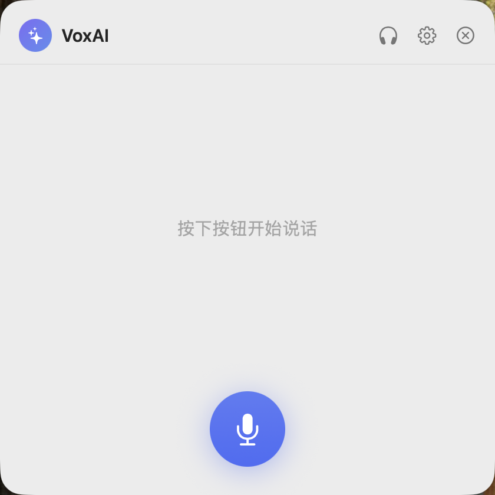
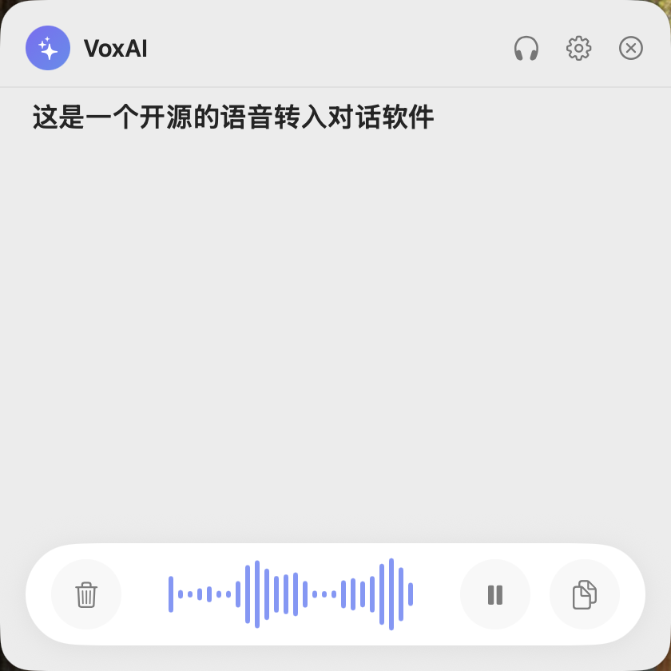
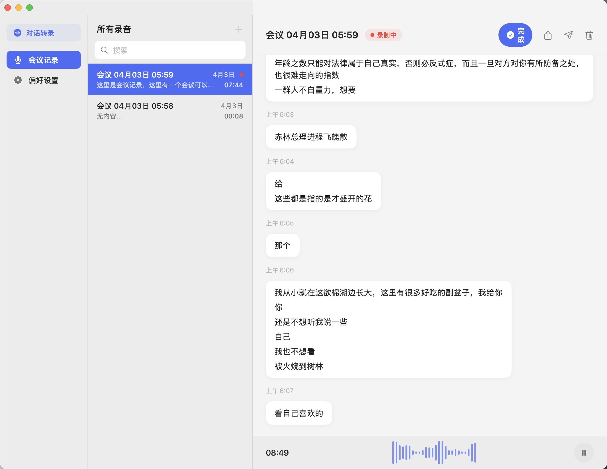
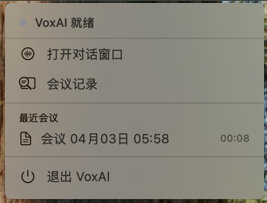
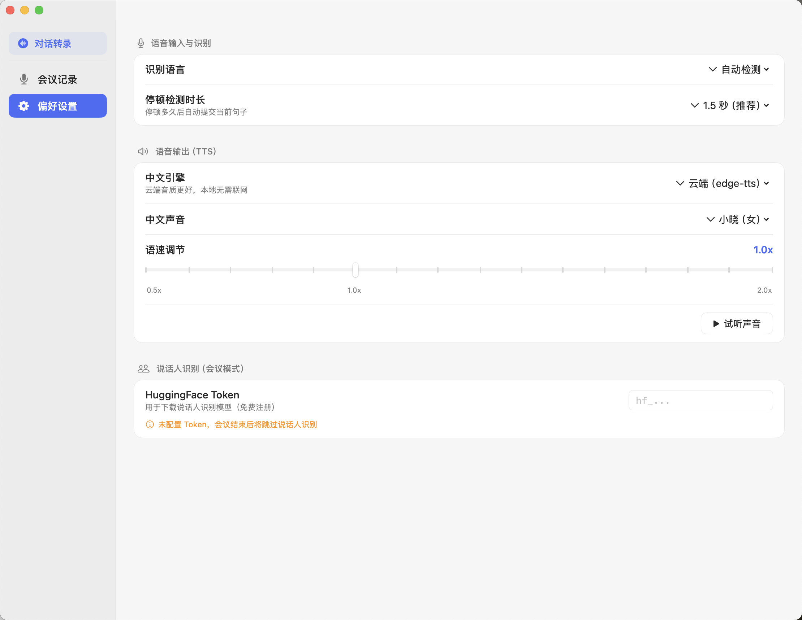

# VoxAI

> Real-time voice transcription and meeting recorder for macOS — built with Swift, SwiftUI, and a local AI backend.


---

## Screenshots

<table>
  <tr>
    <td align="center" width="50%">
      <br/>
      <sub>Dialog mode — idle</sub>
    </td>
    <td align="center" width="50%">
      <br/>
      <sub>Dialog mode — recording</sub>
    </td>
  </tr>
</table>


<sub>Meeting mode — multi-speaker transcription with speaker labels</sub>

<table>
  <tr>
    <td align="center" width="35%">
      <br/>
      <sub>Menu bar</sub>
    </td>
    <td align="center" width="65%">
      <br/>
      <sub>Settings — language, TTS engine, speaker diarization</sub>
    </td>
  </tr>
</table>

---

## What it does

VoxAI is a native macOS menubar app with two modes:

**Dialog Mode** — a floating overlay window that stays on top of any app. Start speaking and watch your words appear in real time with automatic punctuation. Useful during calls, while coding, or whenever you need hands-free transcription.

**Meeting Mode** — a full-window recorder that captures multi-person conversations. After recording, it runs offline speaker diarization (whisperx) to label each speaker's lines. Results are editable and exportable as Markdown.

Both modes are accessible from the menubar and switch seamlessly without restarting any processes.

---

## Features

- **Real-time transcription** via Apple's `SFSpeechRecognizer` with auto-restart at the 60s system limit
- **Speaker diarization** with [whisperx](https://github.com/m-bain/whisperX) — identifies and labels each speaker post-recording
- **TTS output** via MCP — choose between cloud (`edge-tts`) or fully local (`Qwen3-TTS` on Apple Silicon via `mlx-audio`)
- **Lyrics-style display** — completed segments fade gently; the active segment stays bright
- **Silence-based auto-segmentation** — configurable pause threshold (0.5–2.0s) for meeting mode
- **Inline speaker renaming** — click any speaker label to rename; renames propagate across all segments
- **System language switching** — Chinese/English UI follows macOS language settings
- **MCP server** — exposes `list_meetings` and `get_meeting` tools so AI assistants can read your transcripts directly

---

## Tech stack

| Layer | Technology |
|---|---|
| App | Swift 5.9 + SwiftUI, macOS 14+ |
| Real-time ASR | `SFSpeechRecognizer` + `AVAudioEngine` |
| Offline transcription + diarization | [whisperx](https://github.com/m-bain/whisperX) 3.8.5 |
| Local TTS | [mlx-audio](https://github.com/Blaizzy/mlx-audio) + Qwen3-TTS-0.6B (Apple Silicon) |
| Cloud TTS | [edge-tts](https://github.com/rany2/edge-tts) |
| AI integration | [MCP](https://modelcontextprotocol.io/) server (Python) |
| Python runtime | venv (Python 3.13) |

---

## Architecture highlights

**Session generation counter** — `SFSpeechRecognizer` sessions timeout at ~60s. Each restart increments a generation counter; stale callbacks compare their captured generation and early-return if mismatched. This prevents old results from writing into the current segment after a restart.

**Continuous WAV recording across session restarts** — `AVAudioFile` stays open across recognition session restarts so meeting audio is one contiguous file, ready for whisperx diarization after the session ends.

**Window management via stored references** — rather than looking up windows by title (fragile with localization), `TranscriptionService` stores direct `NSWindow` references for both the floating dialog and meeting windows. Switching modes is an `orderOut` + `makeKeyAndOrderFront` on the stored references.

**Stable speaker colors** — Swift's `hashValue` is randomized per-launch. Speaker colors use a unicode scalar reduce hash instead, giving each speaker a stable color across sessions.

---

## Setup

### Requirements

- macOS 14 (Sonoma) or later
- Python 3.11+ (for the backend)
- Xcode 15+ (to build from source)

### Quick start

```bash
git clone https://github.com/Ethan-YS/VoxAI.git
cd VoxAI

# Set up Python backend
python3 -m venv venv
source venv/bin/activate
pip install whisperx mlx-audio edge-tts

# Configure
cp config.example.json config.json
# Edit config.json — add your HuggingFace token for speaker diarization

# Build and run the app
open VoxSage-App/VoxSage.xcodeproj
```

Grant microphone and speech recognition permissions when prompted.

### config.json options

```json
{
  "cn_engine": "cloud",
  "cn_voice": "xiaoxiao",
  "en_voice": "default",
  "speed": 1.0,
  "language": "auto",
  "hf_token": "hf_...",
  "silence_duration": 1.5,
  "recognition_language": "auto"
}
```

A HuggingFace token is only required for speaker diarization. The app works without one — diarization will be skipped.

---

## Download

Pre-built `.dmg` for Apple Silicon is available on the [Releases](../../releases) page.

---

## Project structure

```
VoxSage-App/VoxSage/
├── VoxSageApp.swift          # Entry point — 3 scenes: dialog / meeting / menubar
├── ContentView.swift         # Meeting window — 3-panel layout
├── Views/
│   ├── DialogView.swift      # Floating overlay + lyrics view
│   ├── MeetingView.swift     # Menubar dropdown
│   └── SettingsView.swift    # Settings panel
├── Services/
│   └── TranscriptionService.swift  # Audio engine, ASR session management
├── Models/
│   └── MeetingStore.swift    # Meeting persistence + diarization orchestration
└── zh-Hans.lproj/
    └── Localizable.strings   # Chinese localization

src/
├── mcp/server.py             # MCP server (TTS tools + meeting data access)
└── stt/diarize.py            # whisperx diarization script
```

---

## License

MIT
